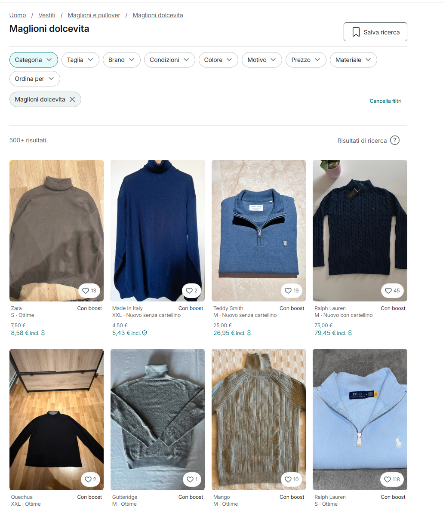
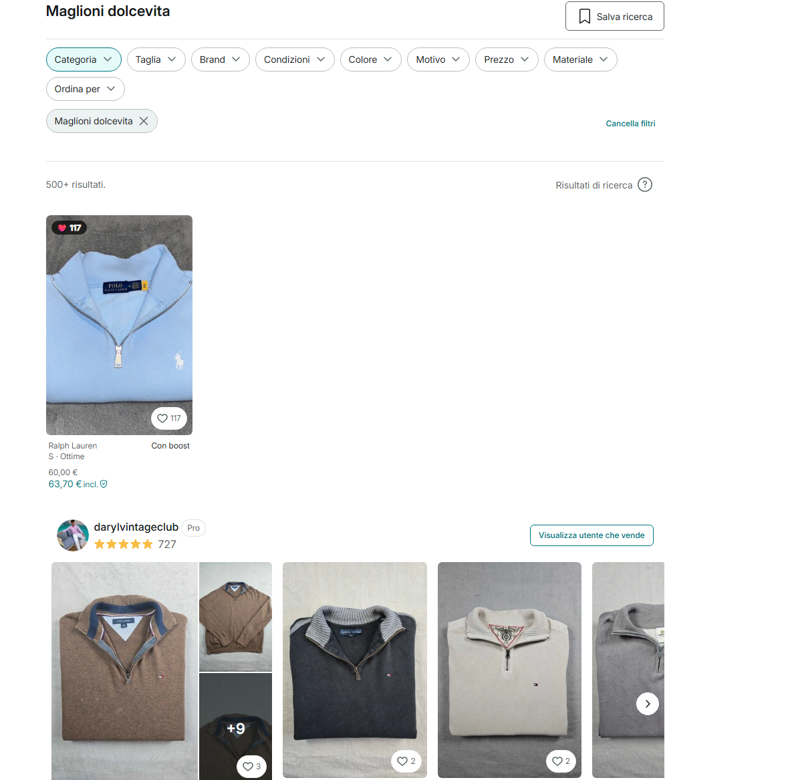

# Vinted Filter by Likes

A Tampermonkey userscript that hides Vinted catalog items below a minimum number of likes (favourites), letting you browse only the most popular listings.

> Built for `vinted.it` — adaptable to other Vinted country domains.

---

## Features

- Hides catalog cards with fewer likes than a configurable threshold
- Reads likes directly from the DOM when available (fast, no API call)
- Falls back to the Vinted internal API for cards without a visible count
- Displays a live ❤️ badge on every visible card
- Handles API rate limiting with automatic retry
- Works on all catalog URLs: category pages, search results, filtered views

---

### Before


### After


---

## Installation

### Requirements

- A Chromium or Firefox-based browser
- [Tampermonkey](https://www.tampermonkey.net/) extension installed

### Steps

1. Install [Tampermonkey](https://www.tampermonkey.net/) from your browser's extension store
2. Click on the Tampermonkey icon → **Create a new script**
3. Delete the default content and paste the contents of [`vinted-filter-likes.user.js`](./vinted-filter-likes.user.js)
4. Press **Ctrl+S** to save
5. Navigate to any Vinted catalog page — the filter will apply automatically after page load

---

## Configuration

At the top of the script, two constants control the behaviour:

```javascript
const MIN_LIKES = 100;     // Minimum likes threshold — items below this are hidden
const API_DELAY_MS = 800;  // Delay in ms between API calls (avoids rate limiting)
```

Adjust `MIN_LIKES` to your preference. Lower values (e.g. `5`) are useful for testing on pages with newer items.

---

## How It Works

1. After page load, the script scans all product cards in the catalog grid
2. For each card, it first tries to read the likes count from the DOM (available on some card types via `aria-label` or a visible counter element)
3. For cards where the count is not in the DOM, it calls the Vinted internal API endpoint `/api/v2/items/{id}` with a configurable delay to avoid rate limiting
4. Cards below the threshold are hidden; visible cards get a ❤️ badge showing the exact count

---

## Supported URLs

The script activates on any URL matching:

```
https://www.vinted.it/catalog*
https://www.vinted.it/catalog/*
```

Examples:

```
https://www.vinted.it/catalog?catalog[]=2984&order=relevance
https://www.vinted.it/catalog/12-tops-and-t-shirts?search_id=...
https://www.vinted.it/catalog?brand_ids[]=...&order=relevance
```

> **Tip:** Use `order=relevance` instead of `order=newest_first`. Newer items have very few likes by nature — relevance-sorted pages surface older, more popular listings.

---

## Adapting to Other Vinted Domains

To use on other country domains (e.g. `vinted.fr`, `vinted.de`), update the `@match` directives and the `API_BASE_URL` in the script header:

```javascript
// @match        https://www.vinted.fr/catalog*
// @match        https://www.vinted.fr/catalog/*
// @connect      www.vinted.fr

const API_BASE_URL = 'https://www.vinted.fr/api/v2/items';
```

---

## Known Limitations

- **Rate limiting**: Vinted limits requests to `/api/v2/items/{id}`. The script handles this with a configurable delay and automatic retry, but on pages with many items the filter may take up to ~60 seconds to complete
- **DOM-only likes**: Vinted does not render the likes count on standard grid cards — only on closet/showcase cards. The API fallback covers the rest
- **Single page only**: The script filters the currently loaded page. It does not paginate automatically
- **Unofficial API**: Vinted does not expose a public API. This script uses internal endpoints that may change without notice

---

## Notes on Terms of Service

This script reads publicly visible data (likes counts on public listings) for personal filtering purposes. It does not automate purchases, scrape user data, or interact with Vinted accounts. Use responsibly.

---

## License

MIT — see [LICENSE](./LICENSE)
